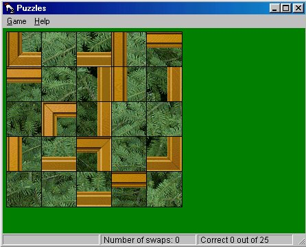



## Puzzles

### Description

The code allows users to select a .bmp picture, so it can be "cut" into 25 pieces (each piece being a piece of a puzzle). The point of the game is to place puzzle pieces into a their correct positions.
 
### More Info
 
bitmap file

The code is not very efficient. It limits expandability. The application was written in several hours, so it has not been well designed.

unexpected errors - "bugs"

             |
---                |---
**Submitted On**   |2000-11-08 15:44:38
**By**             |[Igor Seremet](https://github.com/Planet-Source-Code/PSCIndex/blob/master/ByAuthor/igor-seremet.md)
**Level**          |Beginner
**User Rating**    |4.7 (14 globes from 3 users)
**Compatibility**  |VB 6\.0
**Category**       |[Games](https://github.com/Planet-Source-Code/PSCIndex/blob/master/ByCategory/games__1-38.md)
**World**          |[Visual Basic](https://github.com/Planet-Source-Code/PSCIndex/blob/master/ByWorld/visual-basic.md)
**Archive File**   |[CODE\_UPLOAD114801182000\.zip](https://github.com/Planet-Source-Code/igor-seremet-puzzles__1-12643/archive/master.zip)

